# Shots — fil chronologique run-2

> Vue rapide pour l'humain. Lis du haut vers le bas.

## 2026-04-26 — Run 2 (Castle Clashers, branche `pipeline-cc-Alexis-v0--run-2-castle-clashers`)

### Étape 02 — anchor lockée (DA)

Pas d'iter Playwright procédurale : les PNG officiels Voodoo (`Blue Castle.png`, `Red Castle.png` etc.) servent de référence DA directe. Voir `SANDBOX/anchor/DA-LOCKED.md`.

Frame de référence vidéo : `SANDBOX/frames/sec_01.png` (état initial 100/100, conjoint sur chenilles).

### Étape 04 — implementation

`scene_exterior` (stub Sami → réelle implémentation Alexis) : 350 LoC, gère composite castles + projectile ballistique + impact masques + riposte ennemie scriptée + cut_to_interior.

| Cible | Capture |
|---|---|
| INTERIOR_AIM dev (état initial) | 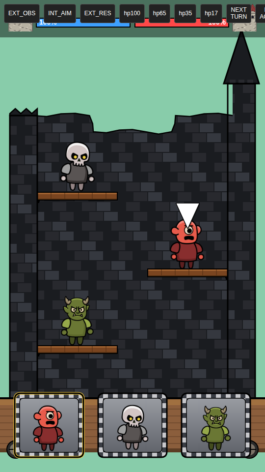 |
| EXTERIOR_OBSERVE (HP 100/100) | 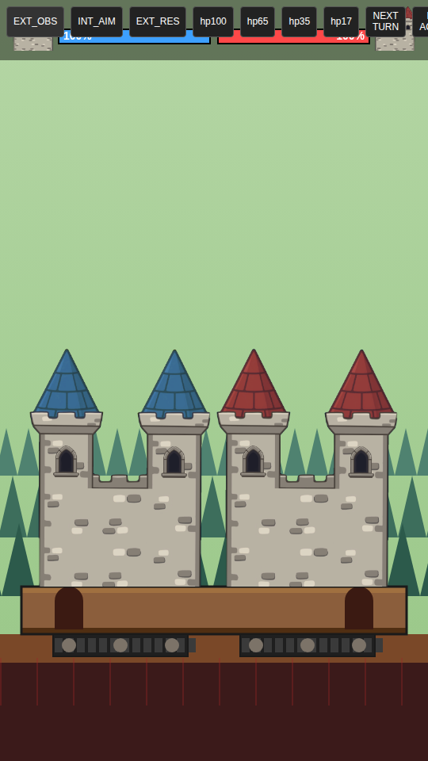 |
| INTERIOR drag-aim actif | 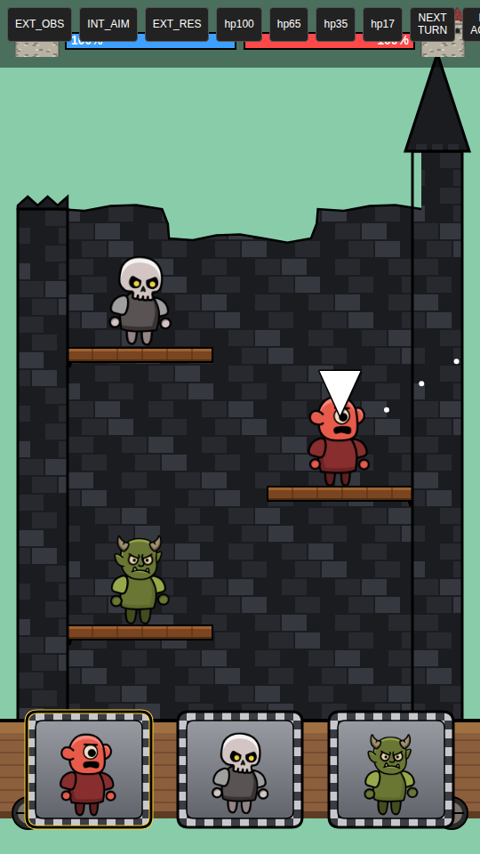 |
| Projectile en vol | 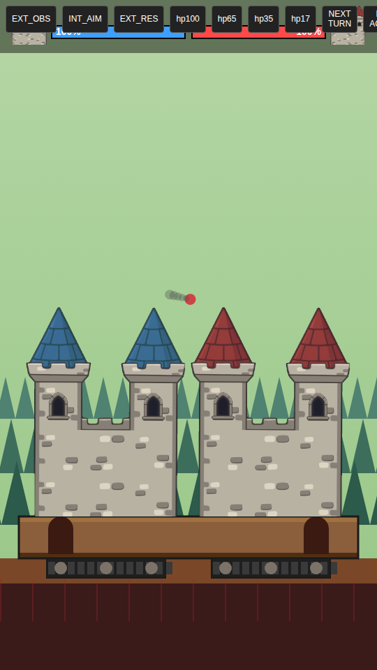 |
| Après impact joueur (-12 enemy) | 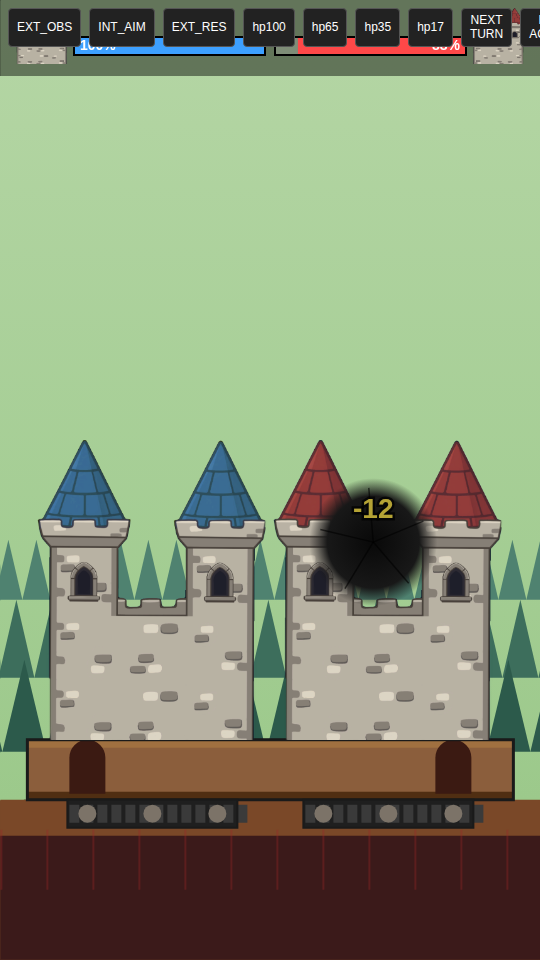 |
| Après riposte ennemie (-9 self) | 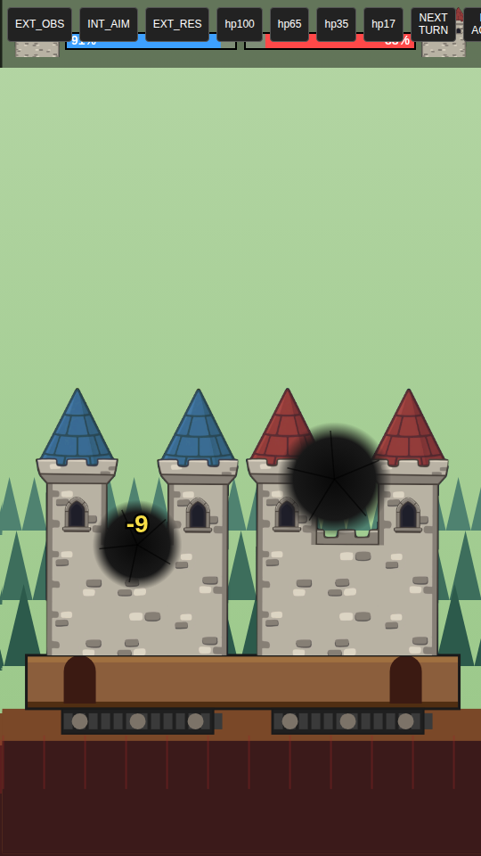 |
| Retour intérieur post-resolve | 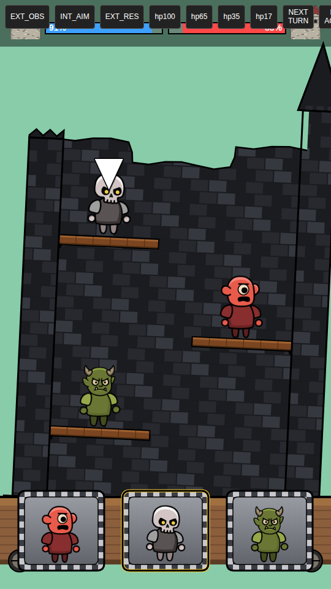 |
| Castle endommagé (HP 35) | 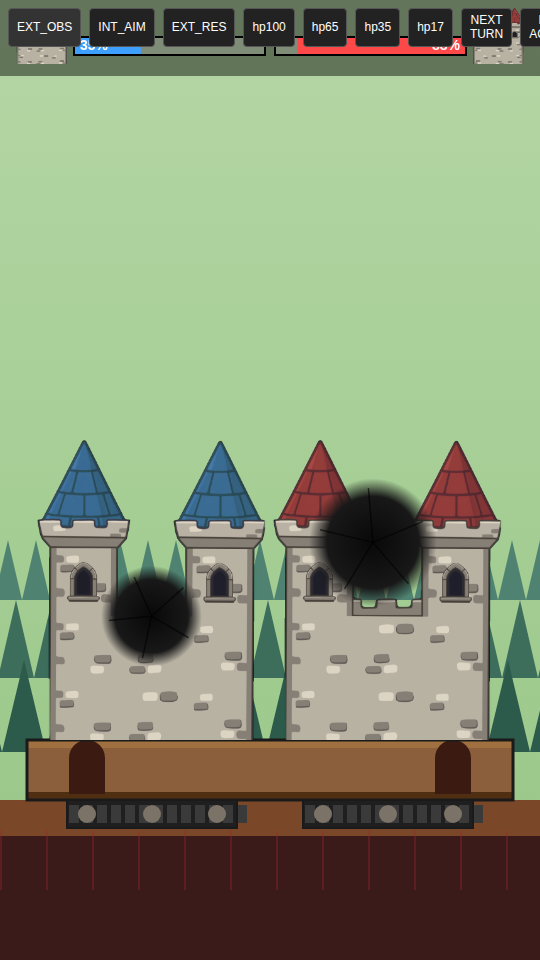 |

### Étape 05 — sweep Playwright des 5 phases narratives

Bundle prod `dist/playable.html` (2.08 MB), `__forcePhase` exposé, sweep sans erreur console.

| Phase | Capture | Note |
|---|---|---|
| initial (INTERIOR_AIM) |  | tutoriel + TAP TO START overlay |
| intro | 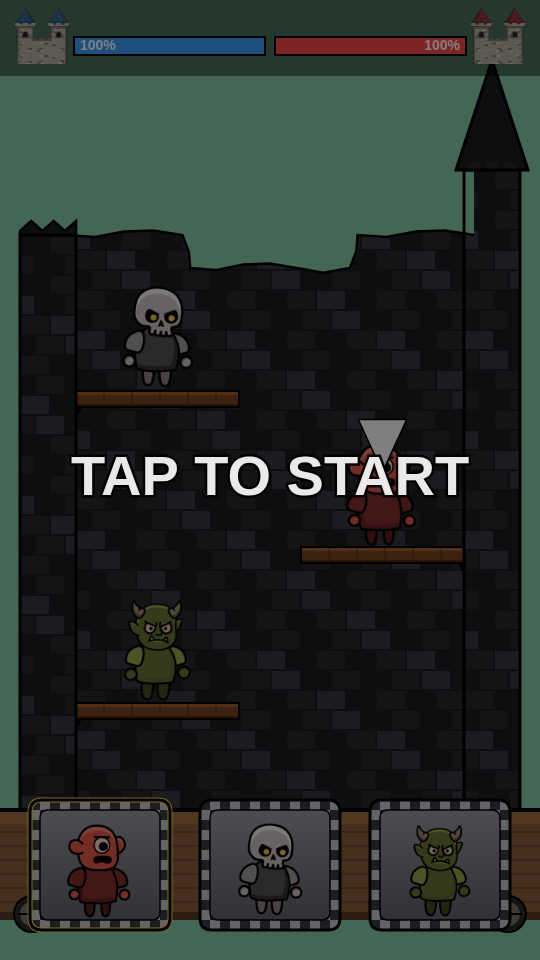 | overlay TAP TO START sur dim screen |
| tutorial | 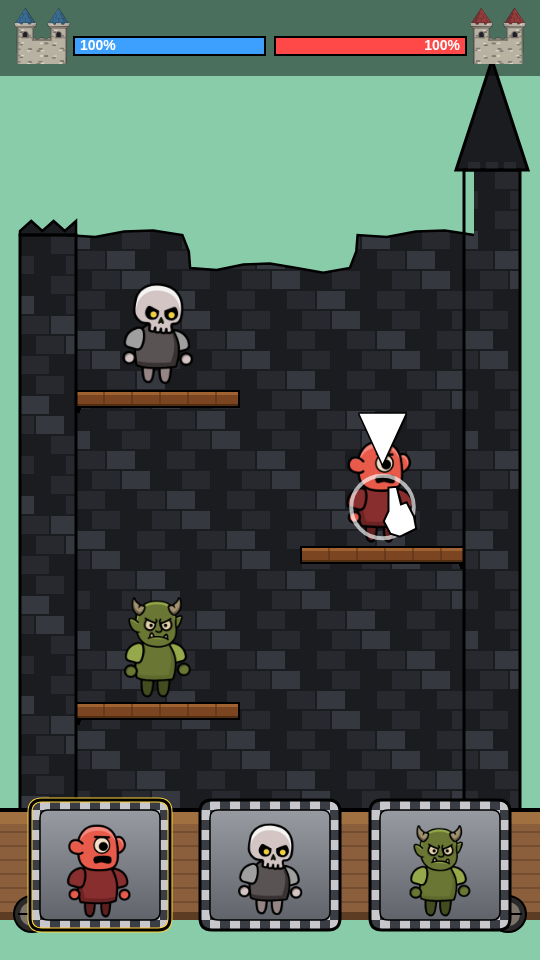 | hand cursor anim sur unité active |
| freeplay | 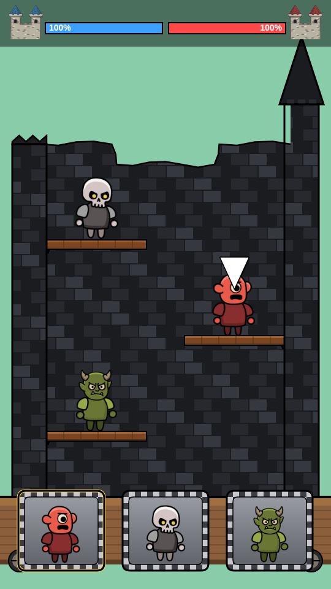 | gameplay libre, pas d'overlay |
| forcewin | 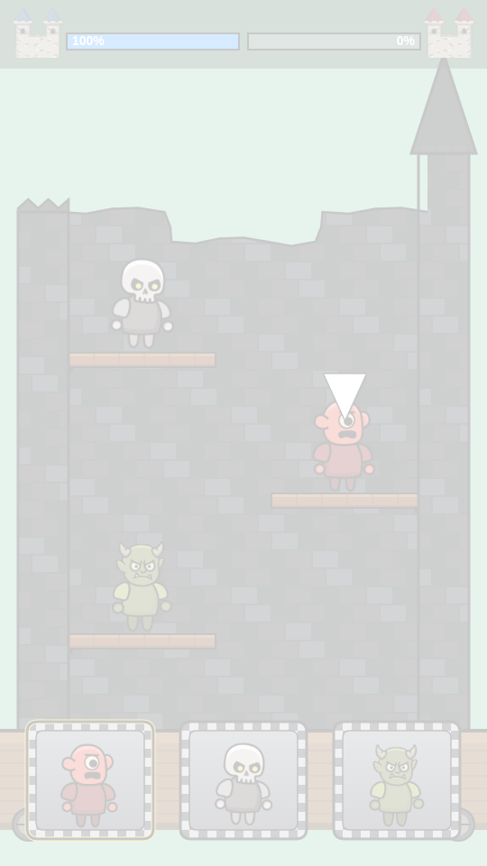 | flash blanc + HP enemy → 0 |
| endcard | 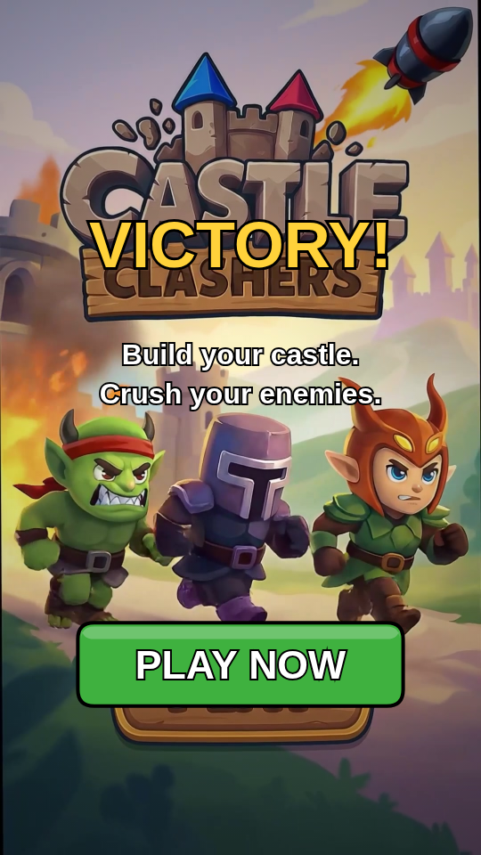 | logo CASTLE CLASHERS + PLAY |

### Étape 06 — bundle

- `dist/playable.html` : **2.08 MB** (cap 4.8 MB OK)
- 0 fetch / 0 XHR / 0 erreur console (verifiée sur Chromium headless via Playwright)
- IIFE minifié, esbuild target es2020
- VSDK shim chargé en premier, assets-inline ensuite, bundle en dernier
- `window.Voodoo.playable.redirectToInstallPage()` câblé sur tap endcard

## Divergences clés (ref `SANDBOX/outputs/divergences.md`)
1. Pas de corbeaux autonomes : bombes ennemies tirées au tour-par-tour
2. Cible input : tap unité ET cartes du bas (UX HTML5 friendly)
3. End-card cast ≠ gameplay cast (deux castings distincts conservés)
4. Nuage vert [00:53] ignoré (artefact)
5. Châteaux conjoints sur chassis partagé (vs face-à-face long champ)
